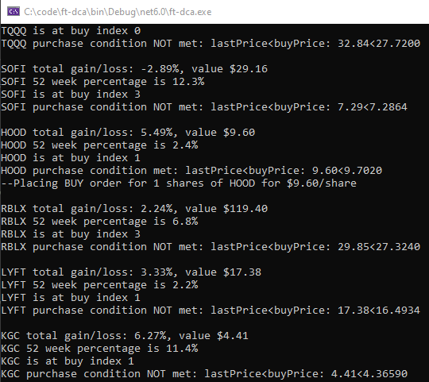

# ft-dca
DCA bot using headless browser that works with Robinhood (buys/sells in dollars) or Firstrade (buys/sells in shares)

Simply update login tag in config.xml (or config_rh.xml for robinhood) and the symbols you would like to DCA

Make sure Playwright is installed using these instructions:

https://playwright.dev/dotnet/docs/intro

This command may also be required for the pwsh command

dotnet tool install --global PowerShell
